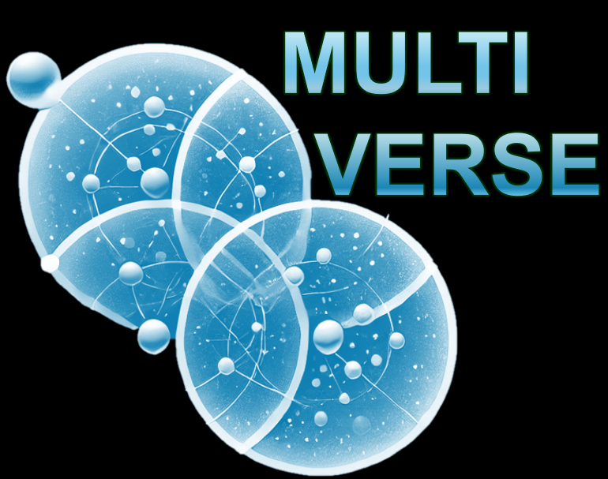

<!-- PROJECT SHIELDS -->
[![Contributors][contributors-shield]][contributors-url]
[![Forks][forks-shield]][forks-url]
[![Stargazers][stars-shield]][stars-url]
[![Issues][issues-shield]][issues-url]
[![MIT Liscence][license-shield]][license-url]

<!-- PROJECT LOGO -->
<p align="center">
  
</p>

<h3 align="center">Multi-verse</h3>

<p align="center">
  A package for comparing MOFA, MOWGLI, MultiVI, and PCA on multimodal datasets, providing scIB metrics and UMAP visualizations.
</p>

<p align="center">
  <a href="https://github.com/sifrimlab/multi-verse/issues">Report Bug</a> ·
  <a href="https://github.com/sifrimlab/multi-verse/pulls">Add Feature</a>
</p>

<p align="right" style="font-size: 8px;">
  <em>Logo generated with the help of ChatGPT.</em>
</p>

<!-- TABLE OF CONTENTS -->
<details open="open">
  <summary><h2 style="display: inline-block">Table of Contents</h2></summary>
  <ol>
    <li>
      <a href="#about-the-project">About The Project</a>
    </li>
    <li>
      <a href="#getting-started">Getting Started</a>
      <ul>
        <li><a href="#prerequisites">Prerequisites</a></li>
        <li><a href="#installation">Installation</a></li>
      </ul>
    </li>
    <li><a href="#usage">Usage</a></li>
    <li><a href="#practicalities">Practicalities</a></li>
      <ul>
        <li><a href="#model-overview">Model Overview</a></li>
        <li><a href="#json-file">JSON File</a></li>
        <li><a href="#results-format">Results Format</a></li>
      </ul>
    <li><a href="#contributing">Contributing</a></li>
   <li><a href="#license">License</a></li>
    <li><a href="#contact">Contact</a></li>
    <li><a href="#contributors">Contributors</a></li>
  </ol>
</details>


<!-- ABOUT THE PROJECT -->
## About The Project

Multi-verse is a Python package designed to facilitate the comparison of multimodal data integration methods, specifically MOFA, MOWGLI, MultiVI, and PCA. By leveraging scIB metrics and generating UMAP visualizations, this package enables researchers to assess and visualize the performance of these methods on their datasets.

Key features:
- Supports comparison of four major methods: [MOFA+](https://biofam.github.io/MOFA2/), [Mowgli](https://mowgli.readthedocs.io/en/latest/index.html), [MultiVI](https://docs.scvi-tools.org/en/1.2.0/user_guide/models/multivi.html), and PCA.
- Provides scIB metrics for integration performance evaluation.
- Generates UMAP visualizations for easy interpretation of results.

<!-- GETTING STARTED -->
## Getting Started

To get a local copy up and running follow steps below.

### Prerequisites

It is recommended to create a new virtual enviroment with [conda](https://www.anaconda.com/).

### Installation

1. Clone the repository:
   ```bash
   git clone https://github.com/sifrimlab/multi-verse.git
   cd multi-verse
   ```

2. Create a new conda environment:
    ```bash
    conda env create -f environment.yml
    conda activate multi_verse
    ```

## Usage
1. To run the script, provide a configuration JSON file as an argument. The configuration file should include all necessary settings for the methods and metrics you want to compare. See "Practicalities" for more information and the config.json for example structure. It includes utilities for preprocessing data, hyperparameter tuning, and evaluation of model performance.

2. Run the code (with exmaple config.json file):
    ```bash
    python main.py config.json
    ```

## Practicalities

### Model Overview

| **Model**  | **Pairing Type**       | **Methodology**                                    | **Hyperparameter Evaluation Metric**         | **Supports scIB Metrics**  |
|------------|------------------------|---------------------------------------------------|--------------------------------|----------------------------|
| PCA        | Unpaired               | Linear Dimensionality Reduction                   | Variance Score                 | Yes                        |
| MOFA+      | Paired                 | Variational Inference                              | Variance Score                | Yes                        |
| MultiVI    | Paired-guided          | Deep Generative Model                              | Silhouette score              | Yes                         |
| Mowgli     | Paired                 | Optimal Transport and Nonnegative Matrix Factorization (NMF) | Optimal Transport Loss        | Yes                         |


### JSON file
The JSON configuration file serves as the blueprint for the pipeline, specifying datasets, preprocessing parameters, and model configurations. Below is a breakdown of the key components of the configuration file:

#### Top-Level Parameters
- _run_user_params: A boolean flag to enable the parameters specified by the user.

- _run_gridsearch: A boolean flag to enable or disable parameterized search for hyperparameter optimization.

#### Datasets
Specifies the datasets used in the pipeline.

- dataset_NAME: Represent the dataset. It needs to contain:
  - data_path: Directory path where data files are stored.
  - rna, atac, and adt: Different modalities (RNA, ATAC, and ADT data).
    - file_name: Name of the data file.
    - is_preprocessed: Whether the data is preprocessed (true or false).
    - annotation: Label for cell types or other metadata.

This pipeline comes preconfigured with two datasets, dataset_Pbmc10k and dataset_TEA, which serve as examples for model comparison or tutorials for getting started with the pipeline. These datasets are already integrated into the configuration file and are ready to use without additional setup.

- dataset_Pbmc10k - download [here](--------------)
  - Description: A multi-modal dataset featuring RNA and ATAC data from 10,000 Peripheral Blood Mononuclear Cells (PBMCs).
  - Data Path: The data is located in the directory specified by data_path.
  - Modalities:
    - RNA: 10x-Multiome-Pbmc10k-RNA.h5ad\
    - ATAC: 10x-Multiome-Pbmc10k-ATAC.h5ad
  - Annotation: Contains cell type annotations, useful for visualization and evaluation.

- dataset_TEA - download [here](--------------)
  - Description: A multi-modal dataset with RNA, ATAC, and ADT modalities, originating from a leukopak sample.
  - Data Path: The data is located in the directory specified by data_path.
  - Modalities:
    - RNA: GSM4949911_X061-AP0C1W1_leukopak_perm-cells_tea_fulldepth_cellranger-arc_filtered_feature_bc_matrix.h5
    - ATAC: Same file as RNA, as ATAC peaks are included.
    - ADT: GSM4949911_tea_fulldepth_adt_counts.csv.gz
  - Annotation: This dataset does not include pre-defined annotations but is ideal for testing multi-modal capabilities.

#### Model
Configures the models and their hyperparameters.

The model flags allows to pick the specific models to be run
- is_mofa+, is_pca, is_multivi, is_mowgli: Enable/disable specific models using a boolean function

Model-specific settings:
- Key hyperparameters for respective models vary between models and need to be correctly specified for the _run_user_params
- device: Specifies computation hardware (cpu or cuda:<index>).
- grid_search_params: Takes a set of hyperparameters specified by the user for parameterized grid search using _run_gridsearch

#### Prerpocessing of modalities 
In the preprocess_params the preprocessing parameters need to be specified for RNA, ATAC, and ADT data.
- RNA and ATAC:
  - min_genes_by_counts, max_genes_by_counts, normalization_target_sum, etc.: Parameters for filtering and normalization.
- ADT:
- per_cell_normalization: Enables normalization for ADT data.

The device to be used for modality preprocessing needs to be specified in the device section at the end:
- device: Specifies the default device (cpu or gpu) for training.

### Results Format

#### Gridsearch
For the grid search, the UMAP and latent embeddings are generated and saved only for the best model for each model-dataset combination after completing the grid search for that combination. The folder is saved in the ./outputs/gridsearch_output folder. Finally the summary of the gridsearch results is printed in the console. There the value of the best score and parameters for each model-dataset combination.

#### Evaluation
The evaluation process assesses the performance of each model using several metrics using [scIB-metrics](https://scib-metrics.readthedocs.io/en/stable/), applied to the latent embeddings generated during the training. Results are summarized for each model-dataset combination and saved in ./outputs/results.json file. 

The following metrics are calculated using the scib.metrics.metrics module:

- Adjusted Rand Index (ARI): Measures clustering accuracy compared to known annotations.
- Normalized Mutual Information (NMI): Evaluates the agreement between cluster assignments and annotations.
- Silhouette Score: Assesses the quality of clustering in terms of sample separation.
- Graph Connectivity (Graph Conn): Evaluates batch mixing and integration effectiveness.
- Isolated Labels Silhouette Score (Isolated ASW): Quantifies how well isolated clusters are preserved after integration.

<!-- CONTRIBUTING -->
## Contributing

Any contributions you make are **greatly appreciated**.

1. Fork the Project
2. Create your Feature Branch (`git checkout -b feature/AmazingFeature`)
3. Commit your Changes (`git commit -m 'Add some AmazingFeature'`)
4. Push to the Branch (`git push origin feature/AmazingFeature`)
5. Open a Pull Request


<!--LICENSE -->
## License

Distributed under the GPL-3 License. See `LICENSE` for more information.


<!-- CONTACT -->
## Contact
Project Link: https://github.com/sifrimlab/multi-verse


## Contributors
This project was developed as part of the Integrated Bioinformatics Project (B-KUL-I0U20A) course at the Faculty of Bioscience Engineering, KU Leuven.

#### Authors
[Yuxin Qiu](https://github.com/yuxin0924)

[Thi Hanh Nguyen Ly](https://github.com/HannahLy1204)

[Zuzanna Olga Bednarska](https://github.com/ZOBednar)
#### Supervisors
Anis Ismail

Lorenzo Venturelli
#### Promotor
Prof. Alejandro Sifrim
#### Course Coordinator
Prof. Vera van Noort


<!-- MARKDOWN LINKS & IMAGES -->
[contributors-shield]: https://img.shields.io/github/contributors/sifrimlab/multi-verse.svg?style=for-the-badge
[contributors-url]: https://github.com/sifrimlab/multi-verse/graphs/contributors
[forks-shield]: https://img.shields.io/github/forks/sifrimlab/multi-verse.svg?style=for-the-badge
[forks-url]: https://github.com/sifrimlab/multi-verse/network/members
[stars-shield]: https://img.shields.io/github/stars/sifrimlab/multi-verse.svg?style=for-the-badge
[stars-url]: https://github.com/sifrimlab/multi-verse/stargazers
[issues-shield]: https://img.shields.io/github/issues/sifrimlab/multi-verse.svg?style=for-the-badge
[issues-url]: https://github.com/sifrimlab/multi-verse/issues
[license-shield]: https://img.shields.io/badge/license-LGPL--3.0--only-green?style=for-the-badge
[license-url]: https://github.com/sifrimlab/multi-verse/LICENSE
